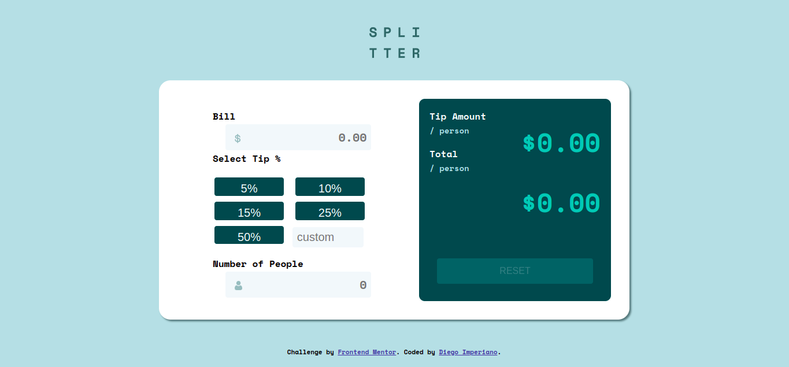
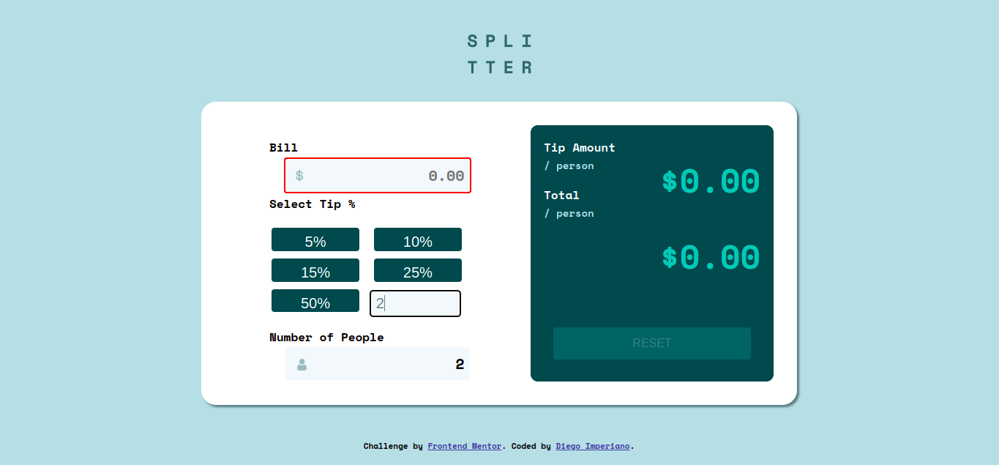

# Tip Calculator

  <a href="#sobre">Sobre</a>&nbsp;&nbsp;&nbsp;|&nbsp;&nbsp;&nbsp;
  <a href="#tecnologias-utilizadas">Tecnologias utilizadas</a>&nbsp;&nbsp;&nbsp;|&nbsp;&nbsp;&nbsp;
  <a href="#como-rodar">Como rodar?</a>&nbsp;&nbsp;&nbsp;|&nbsp;&nbsp;&nbsp;
  <a href="#licença-e-autores">Licença e autor</a>

## Sobre

Esse projeto é uma aplicação desenvolvido com base no desafio da Frontend Mentor: Tip calculator app, onde o objetivo do desafio é criar uma apliacação o mais fiel possível as imagens dadas como base para o desenvolvimento.

Essa aplicação tem como objetivo calcular o valor da gorgeta baseado na porcentagem (escolhida pelo usuario) do valor total da conta. Preenchidos os campos, ao clicar/digitar a porcentagem desejada, o resultado do valor da gorgeta que cada pessoa deverá pagar,assim como o valor total da conta incluindo a gorgeta, será exibido.

Caso a porcentagem seja informada antes de os campos de valor da conta e total de pessoas serem preenchidos, será descado os campos vazios com uma borda vermelha para informar ao úsuario o que falta ser preenchido.

### Resultado final

_Tela inicial:_

_Quando a porcentagem é informada sem que todos os campos sejam preenchidos:_

_Informações calculadas:_

## Tecnologias utilizadas

Este projeto foi desenvolvido utilizando as seguintes tecnologias:

### 💻 Front-end

- [HTML](https://developer.mozilla.org/pt-BR/docs/Web/HTML)
- [CSS](https://developer.mozilla.org/pt-BR/docs/Web/CSS)
- [JavaScript](https://www.javascript.com/)

## Como rodar?

- É um site simples então basta abrir o arquivo index.html
- Também é possível vê-lo funcionando clicando [aqui](https://diegoimperiano.github.io/tip-calculator/).

## To do

Algumas ideias para melhorar a aplicação:

- Adicionar um tema dark.
- Adicionar mais detalhes a respeito da conta.

Sinta-se livre para sugerir novas melhorias e correções [criando uma issue](https://github.com/DiegoImperiano/tip-calculator/issues/new) 😉.

## Licença e autor

Este projeto está sob a licença MIT. Veja o arquivo [LICENSE](https://github.com/DiegoImperiano/tip-calculator/blob/main/LICENSE) para mais detalhes.

Desenvolvido por [Diego Imperiano](https://github.com/DiegoImperiano).

